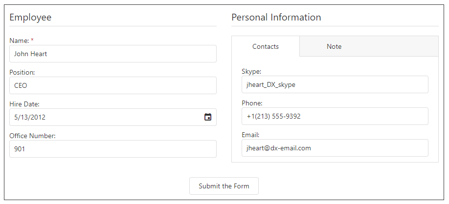

<!-- default badges list -->

<!-- default badges end -->
# DevExtreme Form - Getting Started 

This repository stores the code examples of the Form component for the [Getting Started with Form](https://js.devexpress.com/Documentation/Guide/UI_Components/Form/Getting_Started_with_Form/) tutorial. The component allows users to create a data entry UI for the underlying data object. The Form interface consists of automatically-arranged label-editor pairs that correspond to data fields. 

Users can change data values, validate inputs, and send the resulting data to the server. This tutorial shows how to add the Form to a page, bind it to data, and configure its core features.

This tutorial shows basic Form component configuration.

## Files to Review

- **Angular**
    - [app.component.html](angular/src/app/app.component.html)
    - [app.component.ts](angular/src/app/app.component.ts)
- **jQuery**
    - [index.js](jQuery/src/index.js)
- **React**
    - [App.js](react/src/App.js)
- **Vue**
    - [App.vue](vue/src/App.vue)

## Documentation

- [Getting Started with Form](https://js.devexpress.com/Documentation/Guide/UI_Components/Form/Getting_Started_with_Form/)

- [Form - API Reference](https://js.devexpress.com/Documentation/ApiReference/UI_Components/dxForm/)
<!-- feedback -->
## Does this example address your development requirements/objectives?

 

(you will be redirected to DevExpress.com to submit your response)
<!-- feedback end -->
